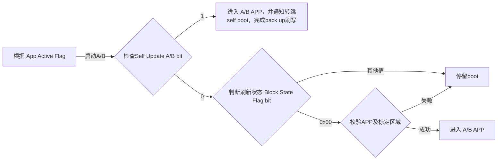
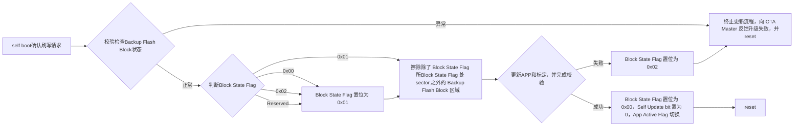
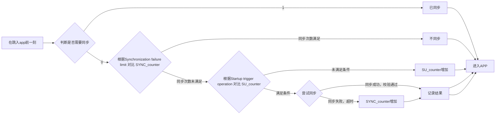

## MCU OTA (DM)

这个需要芯片支持AB分区的自映射（double map）。

### 标志

- `App Active Flag` ： 准备激活的app
- `Self Update A/B bit` ： A/B分区正在进行刷写
- `A/B Block State Flag bit` ： A/B分区状态
- `A&b sync flag`： 刷写完成时设置同步flag为0 / 建议使用APP自带比较标志
- `SU_counter`：启动次数
- `SYNC_counter`：同步次数

### 场景

#### 启动

#### APP内

#### 转跳self boot,刷写back up

#### 同步

暂定由boot进行

- 若在等待同步或同步过程中，模块接收到新的升级请求，应将 FF01 的 Byte3 Bit0 置为 0，Byte4 置为 0xE0 ‘During synchronization’，直到同步完成。

- 在同步过程中，模块无需额外维持整车唤醒。
- 模块应将同步最终结果记录在本地 Log 中。

- 若同步失败，模块应记录 Programming Error Code: PEC 0x030B（Err_ synchronization）。(PEC DID, Programing Error Code dataIdentifier 可参考诊断规范 PA0A2K。)
