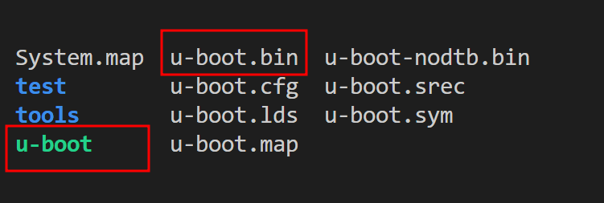

# qemu arm64

## 编译

```bash
make distclean
make qemu_arm64_defconfig
make menuconfig
make ARCH=arm CROSS_COMPILE=aarch64-none-linux-gnu- -j8
```

下图是部分关键编译产物：



## 运行

```bash
# 推荐 -bios
qemu-system-aarch64 -machine virt -cpu cortex-a57 -nographic -smp 1 -m 1G -bios u-boot.bin
qemu-system-aarch64 -machine virt -cpu cortex-a57 -nographic -smp 1 -m 1G -kernel u-boot
```

部分或可选参数解释：

- `-machine virt`: 指定使用 qemu 的 arm64 "virt" 虚拟平台。
- `-cpu cortex-a57`: 指定 CPU 模型，可以是 cortex-a53, cortex-a72 等。
- `-nographic`: 禁用图形界面，使用命令行串口。
- `-smp 1`: 指定 CPU 核心数为 1。（默认不写也为1）
- `-m 1G`: 指定内存大小为 1GB。
- `-bios u-boot.bin`: 指定u-boot.bin作为虚拟机的固件（BIOS）直接加载。qemu会将控制权从内部ROM代码移交至该固件，从而启动一个完整的、符合标准的引导流程。
- `-kernel u-boot`: 直接加载ELF文件(u-boot)作为内核。qemu 会将其加载到内存的适当位置，并跳转到其入口点执行。这种方式跳过了传统的固件阶段。
- `-S`: 在启动时冻结 CPU（不执行任何指令）。
- `-s`: 是 -gdb tcp::1234 的简写，在 TCP 端口 1234 上开启一个 GDB 服务器。

## 调试

```bash
qemu-system-aarch64 -machine virt -cpu cortex-a57 -nographic -smp 1 -m 1G -bios u-boot.bin -S -s
```

在另外一个终端中启动gdb：

```bash
aarch64-none-linux-gnu-gdb uboot -ex "target remote localhost:1234"
```
